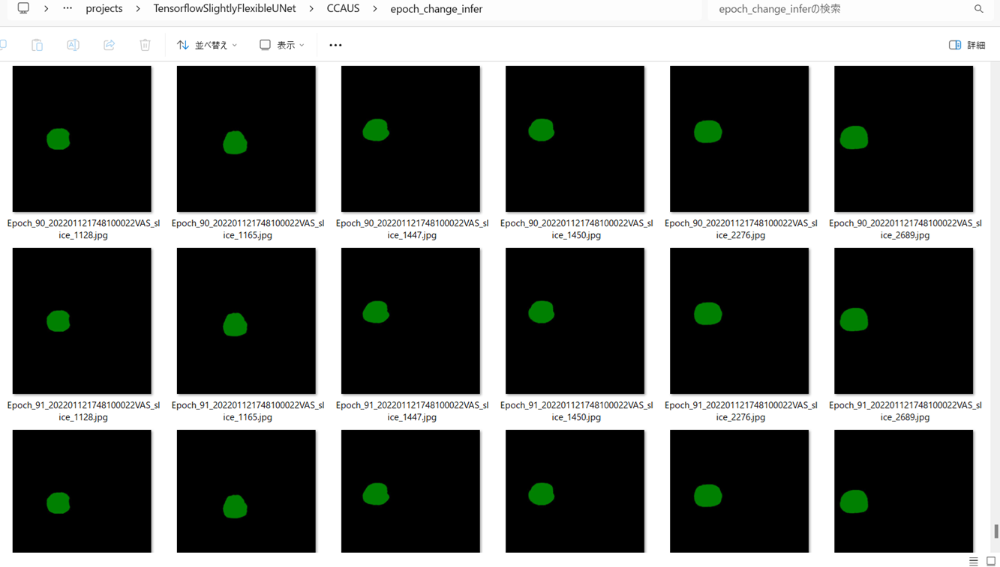
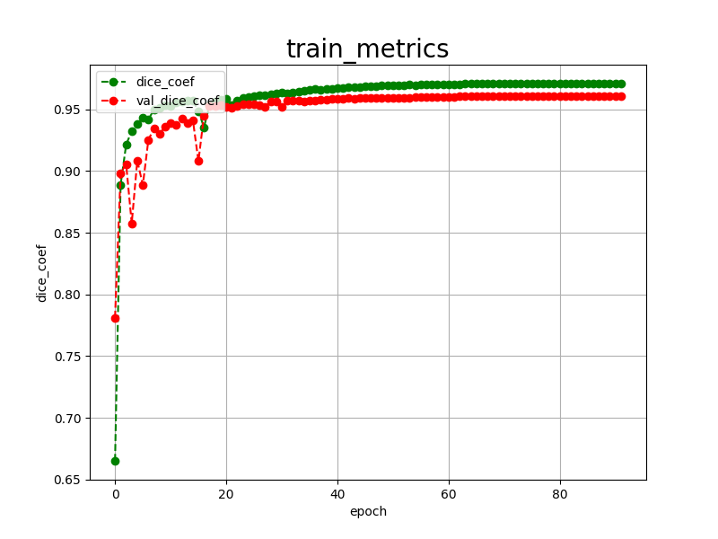

<h2>Tensorflow-Image-Segmentation-Common-Carotid-Artery-UltraSound-Images (2025/02/17)</h2>
Sarah T. Arai 
Software Laboratory antillia.com  

This is the first experiment of Image Segmentation for <b>CCAUS (Common Carotid Artery UltraSound) Images</b>
 based on 
the latest <a href="https://github.com/sarah-antillia/Tensorflow-Image-Segmentation-API">Tensorflow-Image-Segmentation-API</a>, 
and Mendeley <a href="https://data.mendeley.com/datasets/d4xt63mgjm/1">
Common Carotid Artery Ultrasound Images
</a>
 
 

<b>Actual Image Segmentation for Images of 709x749 pixels</b> 
As shown below, the inferred masks look similar to the ground truth masks.  

<table>
<tr>
<th>Input: image</th>
<th>Mask (ground_truth)</th>
<th>Prediction: inferred_mask</th>
</tr>
<tr>
<td></td>
<td></td>
<td></td>
</tr>

<tr>
<td></td>
<td></td>
<td></td>
</tr>

<tr>
<td></td>
<td></td>
<td></td>
</tr>

</table>

 
In this experiment, we used the simple UNet Model 
<a href="./src/TensorflowUNet.py">TensorflowSlightlyFlexibleUNet</a> for this CCAUSSegmentation Model. 
As shown in <a href="https://github.com/sarah-antillia/Tensorflow-Image-Segmentation-API">Tensorflow-Image-Segmentation-API</a>.
you may try other Tensorflow UNet Models: 

<li><a href="./src/TensorflowSwinUNet.py">TensorflowSwinUNet.py</a></li>
<li><a href="./src/TensorflowMultiResUNet.py">TensorflowMultiResUNet.py</a></li>
<li><a href="./src/TensorflowAttentionUNet.py">TensorflowAttentionUNet.py</a></li>
<li><a href="./src/TensorflowEfficientUNet.py">TensorflowEfficientUNet.py</a></li>
<li><a href="./src/TensorflowUNet3Plus.py">TensorflowUNet3Plus.py</a></li>
<li><a href="./src/TensorflowDeepLabV3Plus.py">TensorflowDeepLabV3Plus.py</a></li>

 

<h3>1. Dataset Citation</h3>
The dataset used here has been take from the following Mendeley website: 
<a href="https://data.mendeley.com/datasets/d4xt63mgjm/1">
Common Carotid Artery Ultrasound Images
</a>
  
Momot, Agata (2022), “Common Carotid Artery Ultrasound Images”, 
 Mendeley Data, V1, doi: 10.17632/d4xt63mgjm.1
 
 
<b>Description</b> 
The dataset consists of aquistified ultrasound images of the common carotid artery. 
The images were taken from a Mindary UMT-500Plus ultrasound machine with an L13-3s linear probe. 
The study group consisted of 11 subjects, with each person examined at least once on the left 
and right sides. 2 subjects were examined using the vascular modality and 8 using the carotid modality. 
Time series (DICOM) were converted to png files and cropped appropriately. Each person had 100 images, 
making a total of 1100 images. The dataset also includes corresponding expert masks (corresponding file name) 
made by a technician and verified by an expert. The collection can be used for carotid artery segmentation 
and geometry measurement and evaluation. 
 
Image resolution: 709 x 749 x 3  
Number of images: 2200  
File format: PNG 
 
<b>License:</b> 
<a href="http://creativecommons.org/licenses/by/4.0/">
Creative Commons Attribution 4.0 International License.
</a>
 
 
<h3>
<a id="2">
2 CCAUS ImageMask Dataset
</a>
</h3>
 If you would like to train this CCAUS Segmentation model by yourself,
 please download the dataset <a href="https://data.mendeley.com/datasets/d4xt63mgjm/1">
<b>Common Carotid Artery Ultrasound Images</b>
</a>
  
The folder structure of the dataset is the following. 
<pre>
./Common Carotid Artery Ultrasound Images
   ├─Expert mask images
   │  ├─202201121748100022VAS_slice_1069.png
   │  ├─202201121748100022VAS_slice_1080.png
      ...
   │  └─202202071359200056VAS_slice_258.png
   └─US images
       ├─202201121748100022VAS_slice_1069.png
       ├─202201121748100022VAS_slice_1080.png
       ...
       └─202202071359200056VAS_slice_258.png
</pre>

Please run the following Python script to split the original 709x749 pixels dataset into <b>test</b>, <b>train</b> and <b>valid</b>
 subsets. 
<li><a href="./generator/split_master.py">split_master.py</a></li>

<pre>
./dataset
└─CCAUS
    ├─test
    │   ├─images
    │   └─masks
    ├─train
    │   ├─images
    │   └─masks
    └─valid
        ├─images
        └─masks
</pre>

 
<b>CCAUS Statistics</b> 
 
 
As shown above, the number of images of train and valid datasets is not so large 
to use for a training set of our segmentation model.
 
 
<b>Train_images_sample</b> 

 
<b>Train_masks_sample</b> 

 

<h3>
3 Train TensorflowUNet Model
</h3>
 We have trained CCAUS TensorflowUNet Model by using the following
<a href="./projects/TensorflowSlightlyFlexibleUNet/CCAUS/train_eval_infer.config"> <b>train_eval_infer.config</b></a> file.  
Please move to ./projects/TensorflowSlightlyFlexibleUNet/CCAUSand run the following bat file. 
<pre>
>1.train.bat
</pre>
, which simply runs the following command. 
<pre>
>python ../../../src/TensorflowUNetTrainer.py ./train_eval_infer.config
</pre>

<b>Model parameters</b> 
Enabled Batch Normalization. 
Defined a small <b>base_filters=16</b> and large <b>base_kernels=(9,9)</b> for the first Conv Layer of Encoder Block of 
<a href="./src/TensorflowUNet.py">TensorflowUNet.py</a> 
and a large num_layers (including a bridge between Encoder and Decoder Blocks).
<pre>
[model]
base_filters   = 16
base_kernels   = (9,9)
num_layers     = 8
dilation       = (3,3)
</pre>

<b>Learning rate</b> 
Defined a small learning rate.  
<pre>
[model]
learning_rate  = 0.0001
</pre>

<b>Online augmentation</b> 
Disabled our online augmentation tool. 
<pre>
[model]
model         = "TensorflowUNet"
generator     = False
</pre>

<b>Loss and metrics functions</b> 
Specified "bce_dice_loss" and "dice_coef". 
<pre>
[model]
loss           = "bce_dice_loss"
metrics        = ["dice_coef"]
</pre>
<b >Learning rate reducer callback</b> 
Enabled learing_rate_reducer callback, and a small reducer_patience.
<pre> 
[train]
learning_rate_reducer = True
reducer_factor     = 0.4
reducer_patience   = 4
</pre>

<b>Dataset class</b> 
Specified ImageMaskDataset class.
<pre>
[dataset]
datasetclass  = "ImageMaskDataset"
resize_interpolation = "cv2.INTER_CUBIC"
</pre>

<b>Early stopping callback</b> 
Enabled early stopping callback with patience parameter.
<pre>
[train]
patience      = 10
</pre>

<b>Epoch change inference callbacks</b> 
Enabled epoch_change_infer callback. 
<pre>
[train]

epoch_change_infer      = True
epoch_change_infer_dir  = "./epoch_change_infer"
epoch_change_tiledinfer = False
epoch_change_tiledinfer_dir = "./epoch_change_tiledinfer"
num_infer_images       = 6
</pre>

By using this callback, on every epoch_change, the epoch change tiledinfer procedure can be called
 for 6 image in <b>mini_test</b> folder. This will help you confirm how the predicted mask changes 
 at each epoch during your training process.    

<b>Epoch_change_inference output at starting (1,2,3)</b> 
 
 
 
<b>Epoch_change_inference output at ending (90,91,92)</b> 
 
 
 

In this experiment, the training process was stopped at epoch 92 by EarlyStopping Callback.  
 
 

<a href="./projects/TensorflowSlightlyFlexibleUNet/CCAUS/eval/train_metrics.csv">train_metrics.csv</a> 
 

 
<a href="./projects/TensorflowSlightlyFlexibleUNet/CCAUS/eval/train_losses.csv">train_losses.csv</a> 
 

 

<h3>
4 Evaluation
</h3>
Please move to a <b>./projects/TensorflowSlightlyFlexibleUNet/CCAUS</b> folder, 
and run the following bat file to evaluate TensorflowUNet model for CCAUS. 
<pre>
./2.evaluate.bat
</pre>
This bat file simply runs the following command.
<pre>
python ../../../src/TensorflowUNetEvaluator.py ./train_eval_infer_aug.config
</pre>

Evaluation console output: 

  Image-Segmentation-CCAUS

<a href="./projects/TensorflowSlightlyFlexibleUNet/CCAUS/evaluation.csv">evaluation.csv</a> 

The loss (bce_dice_loss) to this CCAUS/test was low, and dice_coef high as shown below.
 
<pre>
loss,0.0257
dice_coef,0.9583
</pre>
 

<h3>
5 Inference
</h3>
Please move to a <b>./projects/TensorflowSlightlyFlexibleUNet/CCAUS</b> folder 
,and run the following bat file to infer segmentation regions for images by the Trained-TensorflowUNet model for CCAUS. 
<pre>
./3.infer.bat
</pre>
This simply runs the following command.
<pre>
python ../../../src/TensorflowUNetInferencer.py ./train_eval_infer.config
</pre>

<b>mini_test_images (709x749 pixels)</b> 
 
<b>mini_test_mask(ground_truth)</b> 
 

<b>Inferred test masks (709x749 pixels)</b> 
 
 

<b>Enlarged images and masks of 709x749 pixels</b> 

<table>
<tr>
<th>Image</th>
<th>Mask (ground_truth)</th>
<th>Inferred-mask</th>
</tr>

<tr>
<td></td>
<td></td>
<td></td>
</tr>
<tr>
<td></td>
<td></td>
<td></td>
</tr>
<tr>
<td></td>
<td></td>
<td></td>
</tr>
<tr>
<td></td>
<td></td>
<td></td>
</tr>
<tr>
<td></td>
<td></td>
<td></td>
</tr>
<tr>
<td></td>
<td></td>
<td></td>
</tr>
<tr>
<td></td>
<td></td>
<td></td>
</tr>
</table>

 

<h3>
References
</h3>
<b>1. Ultrasound Common Carotid Artery Segmentation Based on Active Shape Model</b> 
Xin Yang, Jiaoying Jin, Mengling Xu, Huihui Wu, Wanji He, Ming Yuchi, Mingyue Ding 
<a href="https://pmc.ncbi.nlm.nih.gov/articles/PMC3606761/">https://pmc.ncbi.nlm.nih.gov/articles/PMC3606761/</a>
 
 

<b>2. Automated Segmentation of Common Carotid Artery in Ultrasound Images</b> 
J. H. Gagan; Harshit S. Shirsat; Grissel P. Mathias; B. Vaibhav Mallya; Jasbon Andrade; K. V. Rajagopal
 
Published in: IEEE Access ( Volume: 10) 
<a href="https://ieeexplore.ieee.org/document/9785785">https://ieeexplore.ieee.org/document/9785785</a>
 
 
<b>3. Method for Carotid Artery 3-D Ultrasound Image Segmentation Based on CSWin Transformer</b> 
Yanping Lin, Jianhua Huang, Wangjie Xu, Cancan Cui, Wenzhe Xu, Zhaojun Li 
 
<a href="https://www.sciencedirect.com/science/article/abs/pii/S0301562922006342">
https://www.sciencedirect.com/science/article/abs/pii/S0301562922006342</a>
 
 

<b>4. Common Carotid Artery Ultrasound</b> 
<a href="https://www.cuh.nhs.uk/patient-information/ultrasound-scan-of-your-carotid-arteries/">
https://www.cuh.nhs.uk/patient-information/ultrasound-scan-of-your-carotid-arteries/</a>
 
 

